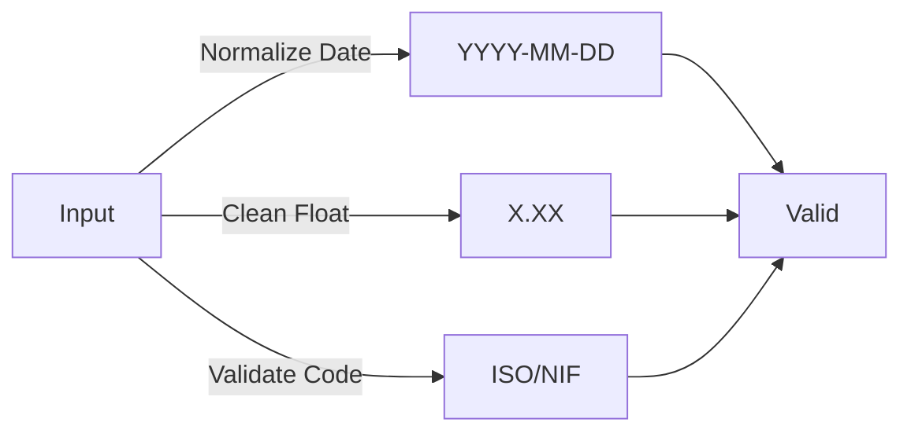

# 📘 Documentação IRS Automator 2025 - Versão 2.0

## 📋 Índice
1. [Visão Geral](#visão-geral)
2. [Melhorias Implementadas](#melhorias-implementadas)
3. [Arquitetura](#arquitetura)
4. [Estrutura de Páginas](#estrutura-de-páginas)
5. [Funcionalidades por Seção](#funcionalidades-por-seção)
6. [Guia de Utilização](#guia-de-utilização)
7. [Anexos Suportados](#anexos-suportados)

---

## 🎯 Visão Geral

**IRS Automator 2025** é uma plataforma web dinâmica de injeção de dados em ficheiros XML de declarações fiscais IRS. 

### Objetivo Principal
Simplificar e automatizar o processo de preenchimento de múltiplos anexos IRS, permitindo:
- ✅ Upload de ficheiros XML originais
- ✅ Edição interativa de dados
- ✅ Validação automática de campos
- ✅ Exportação segura de ficheiros modificados

### Público-Alvo
- Câmara Municipal de Vila Nova de Gaia
- Departamento Fiscal e Administrativo
- Técnicos de IRS
- Cidadãos com múltiplas fontes de rendimento

---

## ✨ Melhorias Implementadas (Versão 2.0)

### 🎨 Interface de Utilizador

#### ANTES (Versão 1.0)
```
❌ Layout linear e sequential
❌ Sem navegação lateral
❌ Ui monótona e confusa
❌ Difícil localizar anexos
❌ Fluxo pouco intuitivo
```

#### DEPOIS (Versão 2.0)
```
✅ Sidebar com menu lateral permanente
✅ 5 páginas temáticas bem organizadas
✅ Cards informativos coloridos
✅ Dashboard visual de anexos
✅ Fluxo intuitivo e lógico
✅ Tabs para organizar conteúdo
✅ Feedback visual melhorado (êxito, erros, avisos)
```

### 🗂️ Reorganização de Áreas

| Seção | Descrição | Benefício |
|-------|-----------|-----------|
| **Home** | Página de entrada com upload centralizado | Ponto de partida claro |
| **Dashboard** | Visualização de todos os anexos com status | Visão geral rápida |
| **Workspace** | Editor dedicado por anexo | Foco na tarefa atual |
| **Configurações** | Documentação integrada | Acesso rápido a referências |
| **Documentação** | Guias e FAQs | Suporte ao utilizador |

### 📊 Novo Sistema de Navegação

```
SIDEBAR (Menu Lateral)
├─ 🏠 Home
├─ 📊 Dashboard de Anexos
├─ 📝 Workspace
├─ ⚙️ Configurações
└─ 📖 Documentação

INDICADOR DE STATUS
├─ Ficheiro Carregado ✅
├─ Nome do Ficheiro
└─ Botão Descarregar
```

### 🎯 Principais Features Novas

1. **Dashboard Interativo**
   - Cards com visualização de anexos
   - Status em tempo real (nº de registos)
   - Filtro de pesquisa por anexo
   - Categorização automática

2. **Workspace Tabs**
   - Tab 1: Dados Existentes (preservação)
   - Tab 2: Novos Dados (colar)
   - Tab 3: Editor (edição manual)
   - Tab 4: Exportar (download/save)

3. **Home Estatísticas**
   - Total de anexos
   - Quadros suportados
   - Total de colunas
   - Status do sistema

4. **Configurações Integradas**
   - Mapa de anexos com detalhe
   - Regras de validação
   - Dicas de utilização
   - Informações do sistema

---

## 🏗️ Arquitetura

### Estrutura do Código

```python
app.py
├─ Configuração Streamlit (page_config, CSS)
├─ Dicionário ANEXOS_CONFIG
│  └─ 6 anexos pré-configurados
├─ Funções de Utilidade XML
│  ├─ get_default_namespace()
│  ├─ extract_data_from_xml()
│  ├─ inject_data_to_xml()
│  └─ ... (mais 8 funções)
├─ Diálogos Modais
│  ├─ dialog_ask_globals()
│  └─ dialog_clear_existing()
├─ Sistema de Navegação
│  ├─ init_session_state()
│  └─ Sidebar Menu
└─ Funções de Páginas
   ├─ page_home()
   ├─ page_dashboard()
   ├─ page_workspace()
   ├─ page_config()
   └─ page_docs()
```

### Stack Técnico
- **Framework**: Streamlit (UI web)
- **XML**: ElementTree (leitura/escrita)
- **Dados**: Pandas (manipulação)
- **Validação**: Regex, tipo casting
- **Armazenamento**: Session State (Streamlit)

---

## 📄 Estrutura de Páginas

### 1️⃣ Página HOME

**Objetivo**: Entrada e onboarding

**Conteúdo**:
- Título + Descritivo
- Uploader de ficheiro XML centralizado
- Estatísticas gerais (anexos, quadros, colunas, status)
- Instruções de início rápido
- Balões de celebração ao carregar ficheiro

**Flow**:
```
Upload XML → Validação → Rerun → Dashboard
```

---

### 2️⃣ Página DASHBOARD

**Objetivo**: Visão geral de todos os anexos

**Conteúdo**:
- Barra de pesquisa (filtro por nome)
- Seletor de ordenação
- Cards agrupados por categoria:
  - 📦 Trabalho Dependente
  - 💰 Mais Valias
  - 🏦 Rendimentos Capitais
  - 💵 Rendimento Estrangeiro
  - 🎁 Deduções
  - 📋 Outros

**Card Info**:
```
┌─────────────────────┐
│ Anexo X - Quadro Y  │
├─────────────────────┤
│ Colunas: 10         │
│ Registos: 5 (🟢)    │
├─────────────────────┤
│ [✏️ Editar]         │
└─────────────────────┘
```

**Flow**:
```
Visualizar Anexos → Pesquisar → Editar → Workspace
```

---

### 3️⃣ Página WORKSPACE

**Objetivo**: Edição completa de dados de um anexo

**Tabs**:

#### Tab 1: 📁 Dados Existentes
- Visualizar dados originais (read-only)
- Opção de apagar histórico
- Status: vazio ou com registos

#### Tab 2: ➕ Novos Dados
- Cole dados do Excel/CSV
- Seletor: incluir cabeçalho?
- Botões:
  - ✅ Adicionar à Tabela
  - 🗑️ Limpar Tabela
- Mensagens de feedback

#### Tab 3: 📝 Editor
- Data editor Streamlit (dinâmico)
- Duplo clique para editar células
- Delete para remover linhas
- Botões:
  - 💾 Guardar Alterações
  - 🗑️ Limpar Tabela

#### Tab 4: 📤 Exportar
- Informação sobre o processo
- Botão: 🔁 Aplicar [Anexo]
- Se sucesso, aparece:
  - 📥 Botão Descarregar (browser)
  - 💾 Botão Guardar (computador local)

**Flow**:
```
Selecionar Anexo → Editar dados → Aplicar → Exportar → Download/Save
```

---

### 4️⃣ Página CONFIGURAÇÕES

**Composição**: 4 Tabs

#### Tab 1: 📚 Anexos
- Expanders para cada anexo com:
  - Tags XML
  - Lista de colunas
  - Mapeamento de campos

#### Tab 2: 🔍 Validação
- Regras de datas (YYYY-MM-DD)
- Regras de valores (2 decimais)
- Regras de códigos (NIF, País, etc.)

#### Tab 3: 💡 Dicas
- 5 dicas de utilização principais
- Atalhos teclado
- Boas práticas

#### Tab 4: ℹ️ Sobre
- Versão e data
- Autor
- Funcionalidades listadas
- Roadmap futuro

---

### 5️⃣ Página DOCUMENTAÇÃO

**Composição**: 3 Expanders

#### Expander 1: 🚀 Guia Rápido
- 4 passos principais
- Screenshots mentalmente
- Informação sequencial

#### Expander 2: 📋 Estrutura de Anexos
- Anexo A (Trabalho)
- Anexo G (Mais Valias)
- Anexo J (Rendimentos)
- Anexo H (Deduções)

#### Expander 3: ⚙️ Config Técnica
- Framework (Streamlit)
- Dependências (XML, Pandas)
- Requisitos Python

---

## 🎮 Funcionalidades por Seção

### Upload e Validação

```python
Fluxo:
1. Selecionar arquivo XML
2. Ler conteúdo (UTF-8)
3. Parse XML com ElementTree
4. Extrair namespace
5. Registar no session_state
6. Transição para Dashboard
```

### Extração de Dados

```python
Para cada anexo:
1. Encontrar elemento raiz (com namespace)
2. Iterar por "Linha" elementos
3. Mapear XML tags → Colunas DataFrame
4. Converter datas (YYYY-MM-DD)
5. Limpar valores monetários
6. Retornar DataFrame
```

### Injeção de Dados

```python
Para cada linha do DataFrame:
1. Criar elemento <Linha>
2. Mapear colunas → XML tags
3. Formatar datas (split em Ano/Mes/Dia)
4. Formatar valores (2 casas decimais)
5. Calcular somatórios automaticamente
6. Appendar ao XML
```

### Exportação

```python
Opção 1 - Download (Browser):
→ BytesIO stream
→ Download button Streamlit
→ Ficheiro no Downloads

Opção 2 - Guardar (Computador):
→ Open Tkinter dialogo
→ Selecionar caminho
→ Write bytes em caminho escolhido
→ Confirmação de sucesso
```

---

## 📚 Guia de Utilização

### Como Começar

#### Passo 1: Home
```
🏠 Carregue o ficheiro XML
└─ Clique no uploader
└─ Selecione ficheiro .xml
└─ Espere validação e processamento
```

#### Passo 2: Dashboard
```
📊 Visualize anexos disponíveis
└─ Browse pelos cards
└─ Veja status em tempo real
└─ Clique em "Editar" para o anexo desejado
```

#### Passo 3: Workspace
```
📝 Edite os dados
└─ Tab "Dados Existentes" - veja originais
└─ Tab "Novos Dados" - cole dados
└─ Tab "Editor" - edite manualmente
└─ Tab "Exportar" - applique e guarde
```

#### Passo 4: Exportar
```
📤 Descarregue ou guarde o XML
└─ Botão Download (simples)
└─ Botão Guardar (customizar caminho)
└─ Ficheiro pronto para Autoridade Tributária
```

### Dicas Importantes

| Dica | Descrição |
|------|-----------|
| **Colar Dados** | Use Ctrl+C do Excel, Ctrl+V na app |
| **Editar Célula** | Duplo clique para edit, Tab para próxima |
| **Eliminar Linha** | Select linha, pressione Delete |
| **Datas** | Aceita dd/mm/yyyy ou yyyy-mm-dd |
| **Valores** | Limpeza automática de formatação |
| **Histórico** | Original preservado, novos dados adicionados |

---

## 📋 Anexos Suportados

### Anexo A - Trabalho Dependente

**Descrição**: Rendimentos de atividade profissional subordinada

**Quadro 04**: Trabalho Dependente (Remuneração)

**Colunas** (7):
- Titular (A/B/C/F)
- NIF Entidade
- Código Rendimentos
- Rendimentos
- Retenções
- Contribuições
- Quotizações

**Somatórios**:
- Soma Rendimentos
- Soma Retenções
- Soma Contribuições

---

### Anexo G - Mais Valias

**Descrição**: Ganhos resultantes de alienação de bens (capital gains)

**Quadro 09**: Mais Valias Realizadas

**Colunas** (10):
- Titular
- NIF
- Código (G01)
- Data Realização (dd/mm/yyyy)
- Valor Realização
- Data Aquisição
- Valor Aquisição
- Despesas
- País Contraparte (cod)
- Valores Mobiliários (S/N)

**Somatórios**:
$\sum$ Valor Realização + $\sum$ Valor Aquisição + $\sum$ Despesas

---

### Anexo J - Juros e Rendimentos de Capitais

**Descrição**: Rendimentos de capital (juros, dividendos)

**Quadro 8.A**: Juros e Rendimentos de Capitais

**Colunas** (5):
- Código Rendimento
- País (ISO 3 digits)
- Rendimento Bruto
- Imposto Pago País Fonte
- Imposto Retido

**Somatórios**:
- Soma Rendimento Bruto
- Soma Imposto Fonte
- Soma Imposto Retido
- Soma Fixa: 0.00

---

### Anexo J - Rendimentos Estrangeiros

**Descrição**: Investimentos e ganhos em mercados internacionais

**Quadro 9.2A**: Rendimentos Estrangeiros

**Colunas** (10):
- País Fonte
- Código (especial)
- Data Realização
- Valor Realização
- Data Aquisição
- Valor Aquisição
- Despesas e Encargos
- Imposto Pago Estrangeiro
- País Contraparte
- Títulos Mobiliários

**Somatórios**:
- Valor Realizado
- Valor Aquisição
- Despesas
- Imposto Estrangeiro

---

### Anexo H - Deduções à Coleta

**Descrição**: Despesas dedutíveis de imposto

**Quadro 06**: Deduções à Coleta

**Colunas** (3):
- Titular (A/B/C/F)
- NIF Entidade (beneficiário)
- Valor (Euros)

**Somatórios**:
- Soma Valor Deduções

---

## 🔄 Fluxos Principais

### Fluxo 1: Upload → Dashboard


### Fluxo 2: Editar → Exportar


### Fluxo 3: Validação de Dados



---

## 🚀 Próximas Melhorias (Roadmap)

- [ ] Suportar mais anexos (B, C, D, E, F, I, etc.)
- [ ] Importação de Excel (.xlsx) direta
- [ ] Exportação para Excel
- [ ] Histórico de alterações (undo/redo)
- [ ] Autossave na cloud
- [ ] API REST para integração externa
- [ ] Modo drag-and-drop
- [ ] Validação em tempo real
- [ ] Relatórios de conformidade
- [ ] Suporte multi-idioma

---

## 📞 Suporte

- **Responsável**: Câmara Municipal de Vila Nova de Gaia
- **Versão**: 2.0 (UI Refatorizada)
- **Data Última Atualização**: 16 de Abril de 2026
- **Tecnologia**: Streamlit + ElementTree + Pandas

---

**© 2026 Câmara Municipal de Vila Nova de Gaia**
